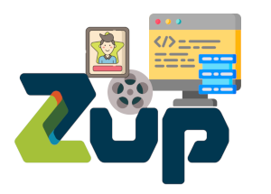

## Sobre o challenge

Este é um simples teste, onde você deverá desenvolver uma pequena aplicação utilizando React, tendo nossas telas como referência. Você deve realizar requests em uma API para adquirir o conteúdo a ser filtrado e mostrado.

Você pode utilizar qualquer boilerplate/CRA que você preferir, mas tente realizar de forma simples. É um plus caso você queira efetuar o seu próprio boilerplate para buildar suas aplicações React. Você também é livre em utilizar as ferramentas que desejar.

### O aplicativo deve ser uma pesquisa de filmes com duas páginas:

* **Home:** Campo de procura que resulta em uma lista;

  _Pense em estado vazio para os filmes, loading e filmes não encontrados_

* **Filmes:** Detalhes dos filmes;

  _Pense sobre loading e detalhes não encontrados_

A proposta deste desafio é para avaliar seu HTML, CSS, Javascript, conhecimento com a lib React entre outras skills que serão demonstradas ao decorrer do projeto.

## Iniciar

1.  Criar uma branch com seu nome;
2.  Resolva o desafio da melhor forma que conseguir;

**Envie o código**

1.  Enviar um Pull Request para a branch `master` deste repositório.

### Dicas

* Escreva um bom README com o básico de informações (ex: como startar o projeto e como buildar);
* Sinta se a vontade em melhorar e avaliar o design. Pense em guidelines;
* Prefira o uso de metodologias css. Ignore o descrito caso opte por utilizar CSS-IN-JS;
* Fazer perguntas é bom. Não vamos te penalizar por fazer perguntar;
* A API as vezes pode demorar em nos responder, pense em loading e estado vazio da sua aplicação;
* Estamos procurando por sinais do seu entendimento de alguns conceitos como, enventos, promises, ciclos de vida e como você aplica e implementa isto em Javascript;
* Testes unitários serão bem valorizados;
* Histórico no git serão bem valorizados;
* Seu código será avaliado por: semântica, estrutura, legibilidade, tamanho, elegância (entre outros fatores);
* Existe um botão de "like" nos detalhes dos filmes. Seria ideal que essa informação persistisse;
* Não existem telas desenhadas para a versão mobile, mas se você criar esta responsividade será um plus.
* Não existe a necessidade de fazer deploy CI/CD da aplicação. Mas se feito, será um bônus;
* Pense em padrões de escrita;
* Não se esqueça de sempre tentar reutilizar os componentes;

### Informações necessárias

#### API:

Nos sugerimos utilizar a [OMDb API](http://www.omdbapi.com/), você também pode optar por utilizar a API de filmes que preferir.

#### Telas / Assets :

**Assets:** Olhe a pasta `/assets`, e ali você irá encontrar tudo que precisa.

**Telas** [Marvel Prototype](https://marvelapp.com/3cj0i64/screen/52947277)  

### Contato

Use as [issues](https://github.com/thiagoaag/leonardotdleal-frontend-challenge/issues) ou envie um email: thiago.amarante@zup.com.br

_Nós vamos amar ver suas skills, boa sorte!_

Credits - Significa.
